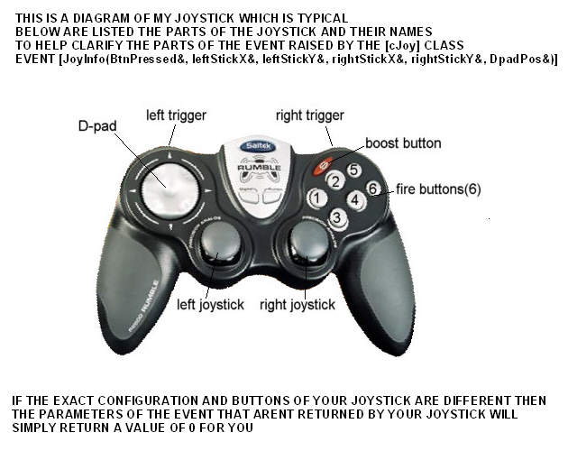



## Joystick Class and dem0

### Description

THis is a joystick class that finds a valid joystick and then returns to you one event that reports everything you need to know to program that joystick..from which button is being pressed to the X and Y pos of both joyhandles(assuming your joypad has two..if only 1 this will still work) to the position of the D-pad
 
### More Info
 
NOTE!!! IMPORTANT!! replace this structure with this....structure provided in submission not correct!!

'-- JOYCAPS User Defined Type.

Private Type JOYCAPS

wMid As Integer

wPid As Integer

szPname As String * 32

wXmin As Long

wXmax As Long

wYmin As Long

wYmax As Long

wZmin As Long

wZmax As Long

wNumButtons As Long

wPeriodMin As Long

wPeriodMax As Long

wRmin As Long

wRmax As Long

wUmin As Long

wUmax As Long

wVmin As Long

wVmax As Long

wCaps As Long

wMaxAxes As Long

wNumAxes As Long

wMaxButtons As Long

szRegKey As String * 32

szOEMVxD As String * 260

End Type

Private typeJoyCaps As JOYCAPS

             |
---                |---
**Submitted On**   |2005-01-04 22:27:10
**By**             |[Evan Toder](https://github.com/Planet-Source-Code/PSCIndex/blob/master/ByAuthor/evan-toder.md)
**Level**          |Intermediate
**User Rating**    |5.0 (15 globes from 3 users)
**Compatibility**  |VB 5\.0, VB 6\.0
**Category**       |[Custom Controls/ Forms/  Menus](https://github.com/Planet-Source-Code/PSCIndex/blob/master/ByCategory/custom-controls-forms-menus__1-4.md)
**World**          |[Visual Basic](https://github.com/Planet-Source-Code/PSCIndex/blob/master/ByWorld/visual-basic.md)
**Archive File**   |[Joystick\_C183678142005\.zip](https://github.com/Planet-Source-Code/evan-toder-joystick-class-and-dem0__1-58111/archive/master.zip)

